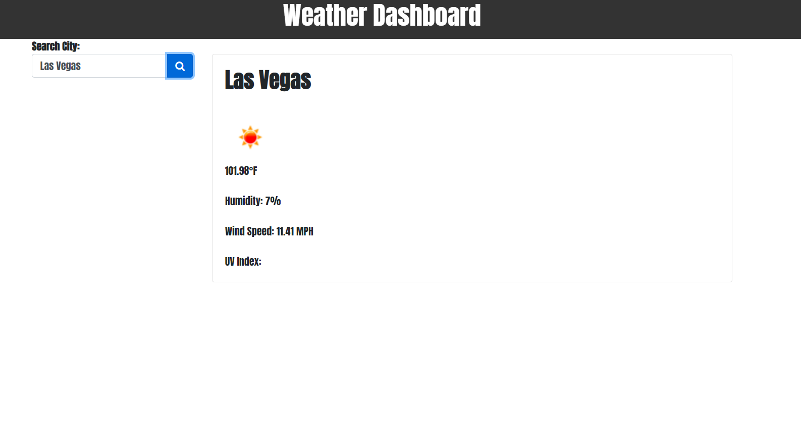

# Weather Applicaton

## About App
This application is a part of homework assignment #6, my goal was to create an application that would allow a user to input a city and search its current weather, along with a 5 day forecast.

## Tech Used
<ul>
<li>HTML
<li>Jquery
<li>CSS
<li>BootStrap
</ul>

## Functionality Still Needed
Work on local storage and getting it to present past searches to the page.
5 day forecast to be presented to page on card group.
For this course I've slightly fallen behind regarding JS/Jquery.

## Links to Repo/Deployed App

[Github Repository]()
[Deployed Applicatoin]()

